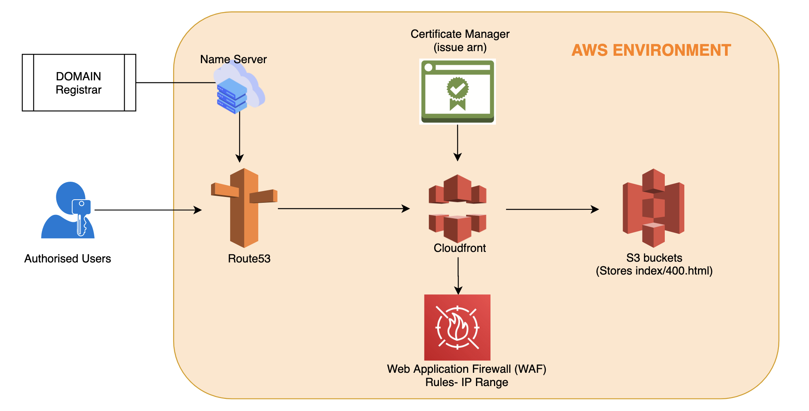

# terraform-s3website-distribution

This terraform module creates a required resources to distribute static contents from s3 bucket and deliver via CloudFront.

Following services will be used to complete this exercise.
- S3
- Route53
- AWS Certificate Manager
- CloudFront
- WAF Classic

## Architecture

# Requirements
* Provide `acm_certificate_arn` as an argument.
* Have index.html and 404.html(typo in architecture) files uploaded into your hosting bucket after terraform is applied successfully. Hosting bucket is basically a main bucket based on your domain name. Therefore, if your domain name is 'xyz.com' then hosting bucket name will be 
  'www.xyz.com'.
  
# Include features:
* Creates necessary S3 buckets with best practices configuration.
    * Bucket #1: (`www.xyz.com`) will be used to store the static contents.
    * Bucket #2: (`xyz.com`) will be used to redirect from the naked domain to main domain. 
* Create route53.
* Create two CloudFront web distribution one per bucket, that also redirect from HTTP to HTTPS
* Create relevant DNS entries pointing to the distribution.
* Implements IP protection, Only whitelisted IP will be able to go through the cloudfront distribution.

## Getting Started:
    cd infra-environment/dev
	terraform init
	terraform plan
	terraform apply

